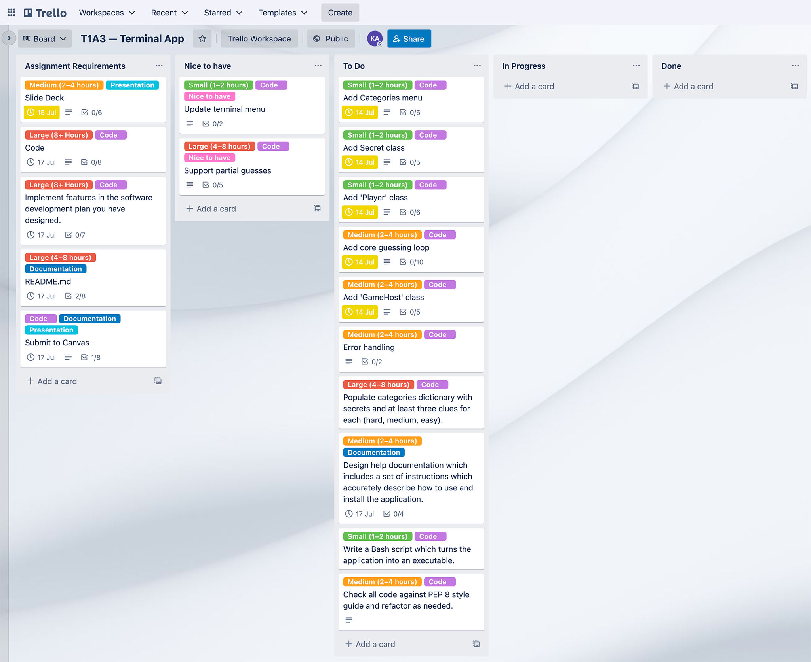
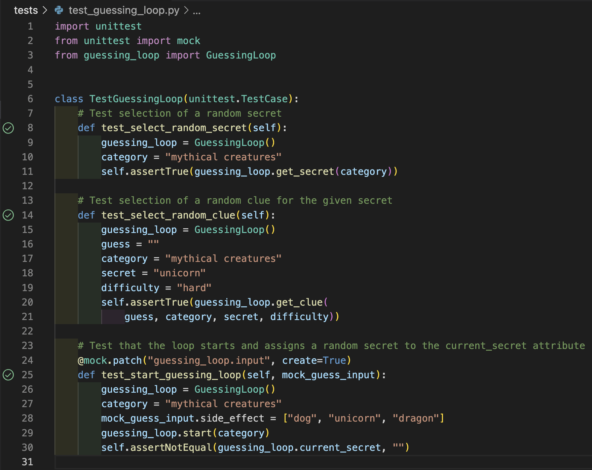
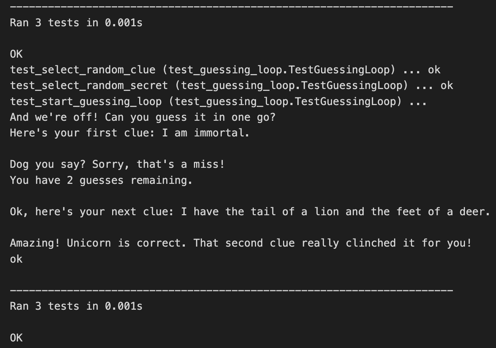

# Kobby Asomani | Coder Academy T1A3 | Terminal Application

## Links
### Source Control Repo
[**View the GitHub repository for this project.**](https://github.com/kobbyasomani/t1a3-terminal-app)

### Style Guide
This application will adhere to the [**Python Enhancement Proposals (PEP) 8 Style Guide for Python Code**](https://peps.python.org/pep-0008/) authored by Guido van Rossum, Barry Warsaw, and Nick Coghlan.

## Application Features
### Overview
This terminal application is a guessing game that allows the user to select from a list of subject categories. The app randomly selects a ‘secret’ number, word, or phrase that the user has to guess, and the user is given clues (selected from a list of clues for each secret), and a limited number of tries to guess the secret. 

When the guessing round starts, the user is given their first clue to the secret. Each time the user inputs an incorrect guess, they are given an additional clue and the number of guesses remaining is decremented. The app also keeps track of and displays stats such as the user’s score, the number of correctly and incorrectly guessed rounds, and the average number of tries to a correct guess.

### 1. Guessing Game Categories
The user can select from several different categories using a menu that is displayed when the application starts, and at the end of each round. Each category uses the same core guessing loop, but with slight differences depending on the type of answer required (e.g., a number, a single word, a multi-word phrase.)

### 2. Random Secret Selection
The application randomly selects a secret word or phrase from the chosen category. Each secret is an object with a correct key, and clues which can be iterated over for each subsequent incorrect guess. Clues are strings (stored in lists/dictionaries) and inserted as variables into string literals as the guessing game progresses. The app imports the random module from the Python Standard Library and uses the `choice()` function to select from the collections of secret words, clues, and feedback phrases.

### 3. The Guessing Loop
The core of the application is the guessing loop, which gives clues and accepts user input based on the selected game category. Conditionals are used within the loop to keep giving clues and responses to each guess. The loop ends when the user correctly guesses the secret, or runs out of guesses.

### 5. Feedback
The app has a list of fun and encouraging phrases it can use in response to user guesses (e.g., “so close!”, “good guess!”, “try again!”, etc.). The phrases are assembled using a combination of variable strings, which are selected partially at random, and partially depending on other factors such as how many guesses the user has remaining. Error handling is used to give feedback when some input considered invalid is entered (e.g., a number is entered in a word guessing game) and ask user to try again, without losing a guess.

### 4. Score Tracking
The user's score and stats are tracked and updated at the end of each round of the guessing game. These stats are displayed above the category selection menu at the end of each round.

## Implementation Plan
This application was developed following an implementation plan tracked using Kanban-style project management software Trello.

My implementation plan included task cards assigned to a list of academic requirements, a to-do list of core coding tasks (broken down by feature), and a list of optional 'nice-to-have' features to be implemented if time permitted.

Task cards are moved from their respective lists to 'In Progress' and 'Done' as the project progresses.  
[**View the Trello board for this project.**](https://trello.com/b/uixdH4cn)

*My task lists on Trello at the start of the project:*

 I followed a Test-Driven Development (TDD) approach for this project, implementing a range of automated tests for each application feature using Python's built-in unittest module.

*Python3 unittest tests and results for the core guessing loop of the game:*

## Help Documentation
### Installation
- [**Download the ZIP file**](https://github.com/kobbyasomani/t1a3-terminal-app/archive/refs/heads/main.zip) from this GitHub repository.
- Unzip the file.
- Open your terminal or command prompt application.
- Navigate to the src directory in your terminal.
- Use the commands 'bash guess.sh' or './guess.sh' in your terminal or command prompt to run the guessing game.
- Have fun!

### Dependencies
- You will need to have Python3 installed on your machine.  
You can [**download Python3 here**](https://www.python.org/downloads/).

### System/Hardware Requirements
- This application should be compatible with any machine that can run Python 3
and has a terminal or command prompt application installed.

### Command Line Arguments
- Type 'bash guess help' into your terminal or command prompt and hit 'enter' or 'return' to open the application help file.

## References
Python Software Foundation 2022, *random — Generate pseudo-random numbers — Python 3.10.5 documentation*, viewed 10 July 2022,  https://docs.python.org/3/library/random.html.

Python Software Foundation 2022, *unittest — Unit testing framework — Python 3.10.5 documentation*, viewed 13 July 2022,  https://docs.python.org/3/library/unittest.html.

Rossum, G van, Warsaw, B, & Coghlan, N 2022, *PEP 8 – Style Guide for Python Code* | peps.python.org, viewed 9 July 2022,  https://peps.python.org/pep-0008/.
