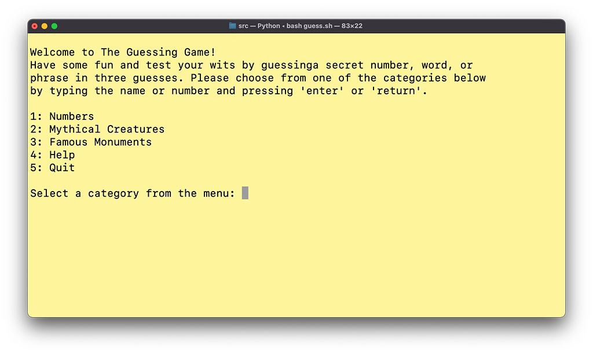

# Kobby Asomani | Coder Academy T1A3 | Terminal Application

## Links
### Source Control Repo
[**View the GitHub repository for this project.**](https://github.com/kobbyasomani/t1a3-terminal-app)

### Style Guide
This application will adhere to the [**Python Enhancement Proposals (PEP) 8 Style Guide for Python Code**](https://peps.python.org/pep-0008/) (Van Rossum, Warsaw, & Coghlan 2022).

## Application Features
### Overview
This terminal application is a guessing game that allows the user to select from a list of subject categories. The app randomly selects a ‘secret’ number, word, or phrase that the user has to guess, and the user is given clues (selected from a list of clues for each secret), and a limited number of tries to guess the secret. 

When the guessing round starts, the user is given their first clue to the secret. Each time the user inputs an incorrect guess, they are given an additional clue and the number of guesses remaining is decremented. The app also keeps track of and displays stats such as the user’s score, the number of correctly and incorrectly guessed rounds, and the average number of tries to a correct guess.

*The game menu screen:*

### 1. Guessing Game Categories
The user can select from several different categories using a menu that is displayed when the application starts, and at the end of each round. Each category uses the same core guessing loop, but with slight differences depending on the type of answer required (e.g., a number, a single word, a multi-word phrase.) The categories list is populated by a method of the Secret class, the members of which add themselves to a nested dictionary of secrets based on their category on instantiation. This dictionary is then passed to the list object, which iterates over the keys and adds them to its menu_items attribute.

*Playing a guessing round in the 'Mythical Creatures' category:*

### 2. Random Secret Selection
The application randomly selects a secret word or phrase from the chosen category. Each secret is an object with a correct key, and clues which can be iterated over for each subsequent incorrect guess. Clues are strings (stored in lists/dictionaries) and inserted as variables into string literals as the guessing game progresses. The app imports the random module from the Python Standard Library and uses the `choice()` function to select from the collections of secret words, clues, and feedback phrases.

*The Secret dataclass and its method for adding itself to the categories dictionary.*

*An object of the Secret class:*

*The Menu class method for populating its list, with some other menu options manually appended:*

### 3. The Guessing Loop
The core of the application is the guessing loop, which gives clues and accepts user input based on the selected game category. Conditionals are used within the loop to keep giving clues and responses to each guess. The loop ends when the user correctly guesses the secret, or runs out of guesses, and then asks the user if they would like to play another round.

The guessing loop sits within an outer while loop that runs in the `main()` function of the program. The `main.py` file imports the menu, 'game host', player, and guessing loop objects from their respective modules and calls their methods in the following order:

1. The player stats are displayed at the top of the terminal if at least one game has been played.
2. The 'gamehost' object prints a welcome message — this message varies depending on hoe many games have been played. 
3. The category menu is printed, and the user is prompted to make a selection from it.
4. The gamehost takes the selected menu category as an argument and prints a welcome message specific to the category.
5. The 'guessing loop' starts, taking the category as an argument. It's `start()` method retrieves a random secret from the given category, and then successively presents clues to the user and waits for guesses.
6. Once the guessing loop ends, the user is prompted to see if they want to keep playing.
7. If yes, the category is reset, the terminal is cleared, and the while loop within the `main()` process starts again, this time displaying their stats from the last game played.
8. If not, the terminal is cleared, the gamehost prints a goodbye message, and the player's stats are printed before exiting.

*The main program and while loop with the object method calls that run the game nested inside:*

### 5. Feedback
The app has a variety of fun and encouraging phrases it can use in response to user guesses (e.g., “so close!”, “good guess!”, “try again!”, etc.). The phrases are assembled using a combination of variable strings, which are selected partially at random, and partially depending on other factors such as how many guesses the user has remaining, or how close their guess matches the secret answer. Error handling and conditional statements are used throughout the guessing loop and and feedback methods of the gamehost object, and is used to give feedback when some input considered invalid is entered (e.g., a number is entered in a word guessing game). If the input is of the incorrect type, the user is then prompted to guess again, without losing a guess.

### 4. Score Tracking
The user's score and stats are tracked and updated at the end of each round of the guessing game. These stats are displayed above the category selection menu at the end of each round, and some attributes such as the total games played are passed to other objects like the gamehost, to inform the kind of feedback it gives.

*Player stats displayed after each round:*

## Implementation Plan
This application was developed following an implementation plan tracked using Kanban-style project management software Trello.

My implementation plan included task cards assigned to a list of academic requirements, a to-do list of core coding tasks (broken down by feature), and a list of optional 'nice-to-have' features to be implemented if time permitted.

Task cards are moved from their respective lists to 'In Progress' and 'Done' as the project progresses.  
[**View the Trello board for this project.**](https://trello.com/b/uixdH4cn)

*My task lists on Trello at the start of the project:*

 I followed a Test-Driven Development (TDD) approach for this project, implementing a range of automated tests for each application feature using Python's built-in unittest module (Python Software Foundation 2022c). I also made use of the difflib and random modules (Python Software Foundation 2022a, 2022b) from the Python Standard Library to achieve random selection of secret words, clues, and game messages, and to attempt partial matching of user guesses to secrets.

*Python 3 unittest tests and results for the core guessing loop of the game:*

## Help Documentation
### Installation
- [**Download the ZIP file**](https://github.com/kobbyasomani/t1a3-terminal-app/archive/refs/heads/main.zip) from this GitHub repository.
- Unzip the file.
- Open your terminal or command prompt application.
- Navigate to the 't1a3-terminal-app-main' directory in your terminal.
- Use the commands 'bash guess.sh' or './guess.sh' in your terminal or command prompt to run the guessing game.
- Have fun!

### Dependencies
- You will need to have Python 3 installed on your machine.  
You can [**download Python 3 here**](https://www.python.org/downloads/).

### System/Hardware Requirements
- This application should be compatible with any machine that can run Python 3
and has a terminal or command prompt application installed.

### Command Line Arguments
- Type 'bash guess help' into your terminal or command prompt and press 'return' to open the application help file.

### How to play:
- Select a category from the list of categories by typing its name or number and pressing 'return'.
- Follow the prompts from the friendly game host to try and guess the secret word!
- You can type 'yes', 'y', or '1', or 'no', 'n', or '0' as responses to yes/no prompts.
- View your stats at the top of the terminal after every game round.
- Type 'quit' and press 'return' during any input prompt to end the game and see your stats.

## References
Python Software Foundation 2022a, *difflib — Helpers for computing deltas — Python 3.10.5 documentation*, viewed 15 July 2022,  https://docs.python.org/3/library/difflib.html.

Python Software Foundation 2022b, *random — Generate pseudo-random numbers — Python 3.10.5 documentation*, viewed 10 July 2022,  https://docs.python.org/3/library/random.html.

Python Software Foundation 2022c, *unittest — Unit testing framework — Python 3.10.5 documentation*, viewed 13 July 2022,  https://docs.python.org/3/library/unittest.html.

Van Rossum, G, Warsaw, B, & Coghlan, N 2022, *PEP 8 – Style Guide for Python Code* | peps.python.org, viewed 9 July 2022,  https://peps.python.org/pep-0008/.
